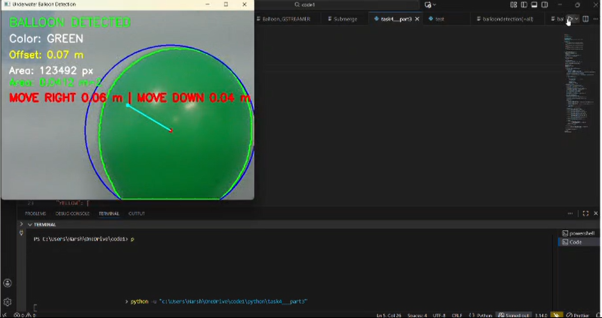

#  Real-Time Balloon Detection using OpenCV

## Overview
This project implements a real-time balloon detection system using computer vision techniques. The program captures video from a webcam and detects colored balloons based on their color, shape, and edges.

The system identifies balloons of different colors and calculates their position relative to the center of the frame. It then generates movement instructions to help align with the balloon and displays a "POP" command when the balloon is correctly aligned.

This project was developed to explore real-time **object detection, image preprocessing, and computer vision using Python and OpenCV**.

---

## Technologies Used
- Python
- OpenCV
- NumPy

---

## Features
- Real-time balloon detection using webcam input
- Detection of multiple balloon colors: **Red, Orange, Yellow, Green, Blue**
- Image preprocessing using **white balance correction**
- Contrast enhancement using **CLAHE**
- Noise reduction using **Gaussian blur and morphological operations**
- Balloon shape validation using **circularity check**
- Edge validation using **Canny edge detection**
- Calculates balloon position relative to the frame center
- Generates alignment instructions (Move Left, Right, Up, Down)
- Displays balloon area and estimated offset distance
- Displays **POP command** when the balloon is aligned

---

## Detection Pipeline
The balloon detection system follows these steps:

1. Capture video from webcam
2. Apply white balance correction
3. Enhance contrast using CLAHE
4. Apply Gaussian blur for noise reduction
5. Convert image to HSV color space
6. Create color masks for different balloon colors
7. Detect contours from the mask
8. Filter contours using:
   - Area threshold
   - Circularity check
   - Edge validation
9. Select the best contour as the detected balloon
10. Calculate balloon center and offset from frame center
11. Generate alignment instructions
12. Trigger **POP command** when aligned

---

## Project Structure

Balloon-Detection  
│  
├── balloon_detection.py  
└── README.md  

---

## How to Run the Project

### 1. Clone the repository

git clone https://github.com/nayanikaprusty518-hue/Balloon-Detection.git

### 2. Install required libraries

pip install opencv-python numpy

### 3. Run the program

python balloon_detection.py

---

## Controls
Press **Q** to exit the program.

---

## Output
The program displays:
- Detected balloon with contour and enclosing circle
- Balloon color
- Distance offset from the frame center
- Balloon area
- Alignment instructions
- "POP" message when the balloon is aligned
- 

---

## Learning Outcomes
- Implemented real-time object detection using OpenCV
- Applied image preprocessing techniques such as white balance and CLAHE
- Used HSV color segmentation for object detection
- Implemented contour analysis and circularity filtering
- Developed alignment logic based on object position
- Practiced managing and documenting projects using GitHub
